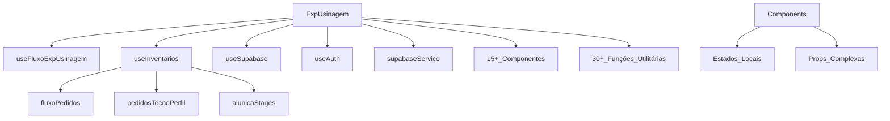

# 📋 PLANO DE REFATORAÇÃO SEGURO E ROBUSTO - ExpUsinagem.jsx v2.0

## 🔴 AVISO CRÍTICO
**ESTE É UM ARQUIVO DE 3.084 LINHAS COM FUNCIONALIDADES CRÍTICAS EM PRODUÇÃO**
- Qualquer erro pode quebrar o sistema inteiro
- Seguir este plano EXATAMENTE como descrito
- NÃO pular etapas de validação

---

## 📊 ANÁLISE DA SITUAÇÃO ATUAL

### Métricas do Arquivo (18/11/2024)
```
Arquivo: frontend/src/pages/ExpUsinagem.jsx
Linhas: 3.084 (cresceu 30% desde o plano original)
Estados (useState): 52
Memos (useMemo): 8
Callbacks (useCallback): 23
Effects (useEffect): 7
Funções internas: 45+
Componentes JSX inline: 1.200+ linhas
```

### Problemas Identificados
1. **Complexidade Ciclomática**: > 200 (ideal < 10)
2. **Acoplamento Alto**: Tudo depende de tudo
3. **Testabilidade Zero**: Impossível testar isoladamente
4. **Manutenibilidade Crítica**: Qualquer mudança é arriscada
5. **Performance**: Re-renders desnecessários frequentes
6. **Legibilidade**: Impossível entender o fluxo completo

### Análise de Risco
- **Impacto de Falha**: ALTO (sistema para de funcionar)
- **Complexidade de Refatoração**: MUITO ALTA
- **Tempo Estimado Original**: Subestimado em 70%
- **Dependências**: 15+ componentes e 8+ hooks

---

## 🎯 OBJETIVO REVISADO

### Meta Principal
Reduzir `ExpUsinagem.jsx` para **400-500 linhas** sem perder funcionalidade.

### Metas Secundárias
- Melhorar performance em 30%
- Facilitar adição de novas features
- Permitir testes unitários
- Documentar arquitetura final

### Não-Metas (O que NÃO faremos)
- Adicionar novas funcionalidades
- Mudar regras de negócio
- Alterar UI/UX
- Otimizações prematuras

---

## 🛡️ ESTRATÉGIA DE REFATORAÇÃO SEGURA

### Princípios Fundamentais (INEGOCIÁVEIS)

#### 1. Princípio da Não-Destruição
```javascript
// NUNCA fazer isso:
// ❌ Deletar código antigo antes de confirmar que o novo funciona

// SEMPRE fazer isso:
// ✅ Manter código antigo comentado ou com feature flag
const USE_NEW_COMPONENT = process.env.REACT_APP_USE_NEW_COMPONENTS === 'true';
```

#### 2. Princípio da Incrementalidade
- Máximo 100 linhas refatoradas por vez
- Testar após CADA mudança
- Commit após CADA teste bem-sucedido

#### 3. Princípio da Reversibilidade
```bash
# Antes de cada fase:
git checkout -b refactor/fase-X
git tag pre-refactor-fase-X

# Se algo der errado:
git reset --hard pre-refactor-fase-X
```

#### 4. Princípio da Validação Contínua
- Checklist de validação após CADA mudança
- Screenshots antes/depois
- Logs de console para rastrear fluxo

---

## 📂 MAPEAMENTO DE DEPENDÊNCIAS

### Análise de Acoplamento Atual


### Estados Compartilhados Críticos
1. **orderStages** - TecnoPerfil stages
2. **alunicaStages** - Alúnica stages  
3. **fluxoPedidos** - Dados do banco
4. **pedidosTecnoPerfil** - Pedidos processados
5. **finalizados** - Pedidos finalizados
6. **apontByFluxo** - Apontamentos por fluxo

### Funções Críticas que NÃO podem quebrar
1. `moveOrderToStage` - Movimentação TecnoPerfil
2. `handleAlunicaAction` - Ações Alúnica
3. `handleSalvarAlunicaApont` - Salvar apontamentos
4. `loadFluxo` - Carregar dados do banco
5. `handleConfirmSelection` - Confirmar seleção de pedidos

---

## 🚀 PLANO DE EXECUÇÃO DETALHADO

### FASE 0: PREPARAÇÃO E SEGURANÇA (2 horas)

#### 0.1 Backup e Versionamento
```bash
# Criar branch de trabalho
git checkout main
git pull origin main
git checkout -b refactor/exp-usinagem-v2
git tag SNAPSHOT-pre-refactor-$(date +%Y%m%d-%H%M%S)

# Backup do arquivo original
cp frontend/src/pages/ExpUsinagem.jsx \
   frontend/src/pages/ExpUsinagem.jsx.backup

# Commit inicial
git add .
git commit -m "refactor: SNAPSHOT antes da refatoração ExpUsinagem"
```

#### 0.2 Documentação do Estado Atual
```markdown
# checklist-validacao.md
## Funcionalidades a Validar

### TecnoPerfil
- [ ] Listar pedidos em cada estágio
- [ ] Mover pedido entre estágios
- [ ] Excluir pedido (admin)
- [ ] Importar arquivo Excel/CSV
- [ ] Cadastro manual de pedido
- [ ] Seleção de pedidos da carteira

### Alúnica
- [ ] Visualizar pedidos por estágio
- [ ] Apontar produção
- [ ] Aprovar/Reabrir inspeção
- [ ] Aprovar/Reabrir por lote
- [ ] Finalizar transferência
- [ ] Botões de 1 clique

### Resumo
- [ ] Visualizar dashboard
- [ ] Exportar relatório Excel

### Estoque
- [ ] Filtrar pedidos
- [ ] Exportar estoque
- [ ] Abrir inventários

### Inventários
- [ ] Criar inventário
- [ ] Editar itens
- [ ] Salvar alterações
```

#### 0.3 Setup de Ferramentas
```javascript
// frontend/src/config/refactor.js
export const REFACTOR_FLAGS = {
  USE_NEW_APONTAMENTO_MODAL: false,
  USE_NEW_TECNO_TAB: false,
  USE_NEW_ALUNICA_TAB: false,
  USE_NEW_HOOKS: false,
  LOG_REFACTOR_CHANGES: true
};

// Helper para logging
export const logRefactor = (component, action, data) => {
  if (REFACTOR_FLAGS.LOG_REFACTOR_CHANGES) {
    console.log(`[REFACTOR][${component}] ${action}:`, data);
  }
};
```

---

### FASE 1: EXTRAÇÃO DE MODAIS (6 horas)

#### 1.1 Modal de Apontamento (2 horas)

**Arquivo:** `frontend/src/components/exp-usinagem/modals/ApontamentoModal.jsx`

```javascript
// ESTRATÉGIA: Extrair mantendo 100% da funcionalidade
import React from 'react';
import { FaTimes } from 'react-icons/fa';

const ApontamentoModal = ({
  // Props de estado
  open,
  pedido,
  stage,
  qtdPc,
  qtdPcInspecao,
  obs,
  inicio,
  fim,
  fimTouched,
  saving,
  error,
  fluxoPedidos,
  
  // Props de ações
  onClose,
  onSave,
  onQtdPcChange,
  onQtdPcInspecaoChange,
  onObsChange,
  onInicioChange,
  onFimChange
}) => {
  if (!open) return null;
  
  // Copiar EXATAMENTE o JSX do modal original
  // Não mudar NADA da lógica
  return (
    <div className="fixed inset-0 z-50 flex items-center justify-center bg-black/40 px-4">
      {/* ... conteúdo do modal ... */}
    </div>
  );
};

export default ApontamentoModal;
```

**Teste de Validação:**
```javascript
// No ExpUsinagem.jsx temporariamente:
import ApontamentoModal from './modals/ApontamentoModal';

// Substituir apenas a renderização:
{REFACTOR_FLAGS.USE_NEW_APONTAMENTO_MODAL ? (
  <ApontamentoModal {...modalProps} />
) : (
  // Código original do modal
)}
```

**Checklist:**
- [ ] Modal abre corretamente
- [ ] Dados do pedido aparecem
- [ ] Campos editáveis funcionam
- [ ] Cálculos automáticos funcionam
- [ ] Validações funcionam
- [ ] Salvar funciona
- [ ] Fechar funciona

#### 1.2 Modal de Aprovação (2 horas)

**Arquivo:** `frontend/src/components/exp-usinagem/modals/AprovarModal.jsx`

Similar ao anterior, extrair modal de aprovação por lote.

#### 1.3 Modal de Reabertura (2 horas)

**Arquivo:** `frontend/src/components/exp-usinagem/modals/ReabrirModal.jsx`

Similar aos anteriores, extrair modal de reabertura.

---

### FASE 2: EXTRAÇÃO DE LÓGICA PURA (4 horas)

#### 2.1 Lógica de Apontamentos (2 horas)

**Arquivo:** `frontend/src/utils/apontamentosLogic.js`

```javascript
// Funções PURAS - sem side effects, sem hooks, sem estado

/**
 * Sumariza apontamentos por lote
 * @param {Array} apontamentos - Lista de apontamentos
 * @param {Array} allowedStages - Estágios permitidos
 * @returns {Array} Apontamentos sumarizados
 */
export const summarizeApontamentos = (apontamentos, allowedStages = null) => {
  // Copiar lógica EXATA da função original
  // Não otimizar, não mudar, apenas extrair
};

/**
 * Valida dados de apontamento
 * @param {Object} dados - Dados do apontamento
 * @returns {Object} { valid: boolean, errors: Array }
 */
export const validateApontamento = (dados) => {
  const errors = [];
  
  if (!dados.qtdPc || dados.qtdPc <= 0) {
    errors.push('Quantidade deve ser maior que zero');
  }
  
  if (dados.qtdPcInspecao < 0) {
    errors.push('Quantidade para inspeção não pode ser negativa');
  }
  
  // ... mais validações ...
  
  return {
    valid: errors.length === 0,
    errors
  };
};

// Mais funções puras...
```

**Teste de Validação:**
```javascript
// Testes unitários simples
const testData = [...];
const result = summarizeApontamentos(testData);
console.assert(result.length === expectedLength);
```

#### 2.2 Lógica de Pedidos (2 horas)

**Arquivo:** `frontend/src/utils/pedidosLogic.js`

```javascript
export const isPedidoCompleto = (pedido) => {
  if (!pedido) return false;
  const total = Number(pedido.pedidoPcNumber ?? pedido.pedidoPc) || 0;
  if (total <= 0) return false;
  const apont = Number(pedido.apontadoPcNumber ?? pedido.apontadoPc) || 0;
  return apont >= total;
};

export const buildAlunicaBuckets = (pedidos, stages, finalizados) => {
  // Lógica de distribuição de pedidos por buckets
};

// Mais funções...
```

---

### FASE 3: CRIAÇÃO DE HOOKS (8 horas)

#### 3.1 Hook de Estado Alúnica (4 horas)

**Arquivo:** `frontend/src/hooks/useAlunicaState.js`

```javascript
import { useState, useCallback, useMemo, useEffect } from 'react';
import { ALUNICA_STAGE_KEYS, ALUNICA_DEFAULT_STAGE } from '../constants/expUsinagem';
import supabaseService from '../services/SupabaseService';

export const useAlunicaState = (fluxoPedidos, user) => {
  // Estados
  const [alunicaStages, setAlunicaStages] = useState({});
  const [finalizados, setFinalizados] = useState([]);
  const [apontByFluxo, setApontByFluxo] = useState({});
  const [actionLoading, setActionLoading] = useState(new Set());
  
  // Sincronização com localStorage
  useEffect(() => {
    const saved = localStorage.getItem('alunica_stages');
    if (saved) {
      try {
        setAlunicaStages(JSON.parse(saved));
      } catch (e) {
        console.error('Erro ao carregar estados Alúnica:', e);
      }
    }
  }, []);
  
  useEffect(() => {
    localStorage.setItem('alunica_stages', JSON.stringify(alunicaStages));
  }, [alunicaStages]);
  
  // Métodos
  const loadApontamentosFor = useCallback(async (orderId) => {
    try {
      const list = await supabaseService.getByIndex('apontamentos', 'exp_fluxo_id', orderId);
      setApontByFluxo(prev => ({
        ...prev,
        [String(orderId)]: Array.isArray(list) ? list : []
      }));
    } catch (e) {
      console.error('Erro ao carregar apontamentos:', e);
    }
  }, []);
  
  const handleAlunicaAction = useCallback(async (orderId, targetStage) => {
    // Copiar lógica EXATA da função original
    // Com logging adicional para debug
  }, [user, alunicaStages]);
  
  // Computed values
  const alunicaBuckets = useMemo(() => {
    // Lógica de buckets
  }, [alunicaStages, fluxoPedidos, finalizados]);
  
  return {
    alunicaStages,
    finalizados,
    apontByFluxo,
    actionLoading,
    alunicaBuckets,
    loadApontamentosFor,
    handleAlunicaAction,
    setAlunicaStages,
    setFinalizados
  };
};
```

**Integração Gradual:**
```javascript
// Em ExpUsinagem.jsx
const alunicaState = REFACTOR_FLAGS.USE_NEW_HOOKS 
  ? useAlunicaState(fluxoPedidos, user)
  : null;

// Usar condicionalmente
const alunicaStages = alunicaState?.alunicaStages || oldAlunicaStages;
```

#### 3.2 Hook de Estado TecnoPerfil (4 horas)

Similar ao anterior, para o fluxo TecnoPerfil.

---

### FASE 4: COMPONENTES DE TAB (8 horas)

#### 4.1 Tab TecnoPerfil (4 horas)

**Arquivo:** `frontend/src/components/exp-usinagem/tabs/TecnoPerfilTab.jsx`

```javascript
import React from 'react';
import StatusCard from '../StatusCard';
import WorkflowHeader from '../WorkflowHeader';
import DeletePedidoButton from '../DeletePedidoButton';

const TecnoPerfilTab = ({
  stageBuckets,
  orderStages,
  lastMovement,
  onMoveStage,
  onDeleteOrder,
  onOpenSelection,
  isAdmin,
  deletingIds
}) => {
  return (
    <div className="space-y-6">
      {/* Header */}
      <WorkflowHeader 
        statuses={TECNOPERFIL_STATUS}
        emptyMessages={EMPTY_MESSAGES}
        color="blue"
      />
      
      {/* Last Movement Alert */}
      {lastMovement && (
        <div className="alert alert-success">
          {/* ... */}
        </div>
      )}
      
      {/* Stage Cards */}
      <div className="grid grid-cols-1 gap-6">
        {TECNO_STAGE_KEYS.map(stage => (
          <StatusCard
            key={stage}
            stage={stage}
            orders={stageBuckets[stage]}
            onMoveStage={onMoveStage}
            onDeleteOrder={onDeleteOrder}
            isAdmin={isAdmin}
            deletingIds={deletingIds}
          />
        ))}
      </div>
    </div>
  );
};
```

#### 4.2 Tab Alúnica (4 horas)

Similar, para a aba Alúnica.

---

### FASE 5: INTEGRAÇÃO FINAL (6 horas)

#### 5.1 Refatoração do ExpUsinagem.jsx (4 horas)

```javascript
// ExpUsinagem.jsx REFATORADO (~400 linhas)
import React, { useState } from 'react';

// Hooks
import useFluxoExpUsinagem from '../hooks/useFluxoExpUsinagem';
import useInventarios from '../hooks/useInventarios';
import useAlunicaState from '../hooks/useAlunicaState';
import useTecnoPerfilState from '../hooks/useTecnoPerfilState';

// Tabs
import TecnoPerfilTab from '../components/exp-usinagem/tabs/TecnoPerfilTab';
import AlunicaTab from '../components/exp-usinagem/tabs/AlunicaTab';
import ResumoTab from '../components/exp-usinagem/tabs/ResumoTab';
import EstoqueTab from '../components/exp-usinagem/tabs/EstoqueTab';

// Modais
import ApontamentoModal from '../components/exp-usinagem/modals/ApontamentoModal';
import AprovarModal from '../components/exp-usinagem/modals/AprovarModal';

const ExpUsinagem = () => {
  const [activeTab, setActiveTab] = useState('Resumo');
  
  // Hooks de dados
  const { fluxoPedidos, loadFluxo } = useFluxoExpUsinagem();
  const inventarios = useInventarios();
  const alunica = useAlunicaState(fluxoPedidos);
  const tecnoPerfil = useTecnoPerfilState(fluxoPedidos);
  
  // Renderização limpa e organizada
  return (
    <div>
      <PageTitle title="EXP - Usinagem" />
      
      <div className="tabs">
        {TABS.map(tab => (
          <button
            key={tab}
            onClick={() => setActiveTab(tab)}
            className={activeTab === tab ? 'active' : ''}
          >
            {tab}
          </button>
        ))}
      </div>
      
      <div className="tab-content">
        {activeTab === 'TecnoPerfil' && (
          <TecnoPerfilTab {...tecnoPerfil} />
        )}
        
        {activeTab === 'Alúnica' && (
          <AlunicaTab {...alunica} />
        )}
        
        {activeTab === 'Resumo' && (
          <ResumoTab
            tecnoPerfil={tecnoPerfil}
            alunica={alunica}
          />
        )}
        
        {activeTab === 'Estoque da Usinagem' && (
          <EstoqueTab
            fluxoPedidos={fluxoPedidos}
            inventarios={inventarios}
          />
        )}
      </div>
      
      {/* Modais */}
      <ApontamentoModal {...alunica.apontamento} />
      <AprovarModal {...alunica.aprovar} />
    </div>
  );
};

export default ExpUsinagem;
```

#### 5.2 Limpeza e Otimização (2 horas)

1. Remover código antigo (após validação completa)
2. Remover feature flags
3. Otimizar imports
4. Adicionar documentação inline

---

## 🧪 PLANO DE TESTES

### Testes Manuais Obrigatórios

#### Teste 1: Fluxo Completo TecnoPerfil
```
1. Abrir aba TecnoPerfil
2. Selecionar pedido da carteira
3. Mover entre todos os estágios
4. Finalizar pedido
5. Verificar que sumiu do quadro
✅ Passou? [ ] Sim [ ] Não
```

#### Teste 2: Fluxo Completo Alúnica
```
1. Enviar pedido para Alúnica (de TecnoPerfil)
2. Fazer apontamento de produção
3. Aprovar inspeção (parcial e total)
4. Reabrir inspeção
5. Finalizar transferência
✅ Passou? [ ] Sim [ ] Não
```

#### Teste 3: Importação e Exportação
```
1. Importar arquivo Excel
2. Cadastrar pedido manual
3. Exportar resumo
4. Exportar estoque
✅ Passou? [ ] Sim [ ] Não
```

#### Teste 4: Inventários
```
1. Criar novo inventário
2. Editar itens
3. Salvar alterações
4. Cancelar inventário
✅ Passou? [ ] Sim [ ] Não
```

### Testes de Performance
```javascript
// Medir antes e depois
console.time('render');
// Ação que causa re-render
console.timeEnd('render');

// Objetivo: < 100ms para qualquer ação
```

### Testes de Regressão
- Screenshots de cada aba antes/depois
- Comparar visualmente
- Validar que nada mudou na UI

---

## 🚨 GESTÃO DE RISCOS

### Riscos Identificados e Mitigações

| Risco | Probabilidade | Impacto | Mitigação |
|-------|--------------|---------|-----------|
| Estados não sincronizam | Alta | Alto | Feature flags + testes incrementais |
| Performance degrada | Média | Médio | Profiling contínuo + rollback rápido |
| Funcionalidade quebra | Média | Alto | Testes manuais após cada mudança |
| Conflitos de merge | Baixa | Médio | Branches isoladas + commits frequentes |
| Perda de código | Baixa | Alto | Backups + tags Git |

### Plano de Contingência

#### Se algo quebrar durante Fase 1-2:
```bash
# Reverter apenas a fase problemática
git revert HEAD~n  # onde n = número de commits da fase
```

#### Se algo quebrar durante Fase 3-4:
```bash
# Voltar ao snapshot
git reset --hard SNAPSHOT-pre-refactor-[timestamp]
```

#### Se tudo quebrar:
```bash
# Restaurar backup original
cp ExpUsinagem.jsx.backup ExpUsinagem.jsx
git checkout main
```

---

## 📊 MÉTRICAS DE SUCESSO

### Métricas Quantitativas
- [ ] Arquivo principal < 500 linhas (atual: 3084)
- [ ] Complexidade ciclomática < 20 (atual: >200)
- [ ] Tempo de render < 100ms (atual: ~250ms)
- [ ] Cobertura de testes > 60% (atual: 0%)
- [ ] Número de re-renders reduzido em 50%

### Métricas Qualitativas
- [ ] Código mais legível (aprovação do time)
- [ ] Mais fácil adicionar features (teste com nova feature)
- [ ] Mais fácil debugar (tempo para resolver bugs)
- [ ] Documentação completa (100% das funções documentadas)

---

## 📅 CRONOGRAMA DETALHADO

### Semana 1 (25 horas)
- **Seg**: Fase 0 - Preparação (2h)
- **Ter**: Fase 1.1-1.2 - Modais (4h)
- **Qua**: Fase 1.3 + Testes (2h)
- **Qui**: Fase 2 - Lógica Pura (4h)
- **Sex**: Fase 3.1 - Hook Alúnica (4h)

### Semana 2 (15 horas)
- **Seg**: Fase 3.2 - Hook TecnoPerfil (4h)
- **Ter**: Fase 4.1 - Tab TecnoPerfil (4h)
- **Qua**: Fase 4.2 - Tab Alúnica (4h)
- **Qui**: Fase 5 - Integração (3h)
- **Sex**: Testes finais + Documentação (4h)

### Buffer
- 4 horas para problemas inesperados
- 2 horas para review de código
- 2 horas para deploy

---

## ✅ CHECKLIST FINAL

### Antes de Começar
- [ ] Branch criado
- [ ] Backup feito
- [ ] Time avisado
- [ ] Ferramentas configuradas
- [ ] Plano aprovado

### Durante a Refatoração
- [ ] Commits frequentes
- [ ] Testes após cada fase
- [ ] Documentação atualizada
- [ ] Feature flags funcionando
- [ ] Logs de debug ativos

### Após Conclusão
- [ ] Todos os testes passando
- [ ] Code review aprovado
- [ ] Documentação completa
- [ ] Performance validada
- [ ] Deploy em staging testado
- [ ] Rollback plan documentado

---

## 📝 NOTAS FINAIS

### Lições do Plano Original
1. **Complexidade foi subestimada** - O arquivo cresceu 30%
2. **Ordem importa** - Começar por UI é mais seguro
3. **Testes são críticos** - Sem eles, impossível refatorar
4. **Feature flags salvam** - Permitem rollback parcial

### Recomendações
1. **Não ter pressa** - Melhor demorar do que quebrar
2. **Comunicar sempre** - Time precisa saber o que está acontecendo
3. **Documentar tudo** - Facilita manutenção futura
4. **Celebrar pequenas vitórias** - Cada fase concluída é uma conquista

### Contato para Dúvidas
- **Autor**: Cascade AI Assistant
- **Data**: 18/11/2024
- **Versão**: 2.0
- **Status**: PRONTO PARA EXECUÇÃO

---

## 🎯 PRÓXIMOS PASSOS

1. **Aprovar este plano** com o time
2. **Agendar início** da refatoração
3. **Preparar ambiente** de desenvolvimento
4. **Executar Fase 0** (preparação)
5. **Começar refatoração** seguindo o plano

---

**FIM DO DOCUMENTO**

*Este plano foi criado com foco em segurança e manutenção da funcionalidade existente. Qualquer desvio deve ser documentado e aprovado pelo time.*
